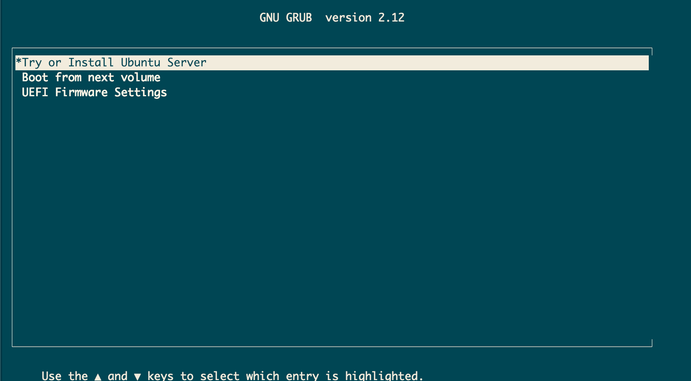
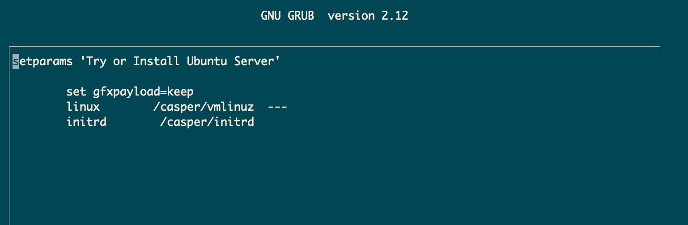
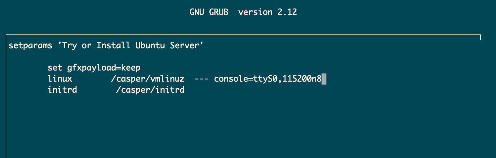

# How to Setup the AMDSEV project on Ubuntu 24.04

#NOTE - THIS IS RECENTLY DEPRECATED. Since Kernel 6.11 SNP has been enabled in the kernel, so there is no need to use the AMDSEV project. Now you can enable SEV/SNP on the HOST or VM just by having Kernel 6.11 installed.

# Step 1 - Setup APT repositories and install necessary packages

**Note: Remember - All commands are assuming you are ROOT user**

Backup your  APT sources list    
```sh
cp /etc/apt/sources.list /etc/apt/sources.list.backup
```

Then enable the deb-src repositories

```sh
sed -Ei 's/^# deb-src /deb-src /' /etc/apt/sources.list
```

Update your Repository lists
```sh
apt update
```

Then install the necessary packages
```sh
apt install build-essential python3-venv python3-pip git pkg-config libssl-dev libglib2.0-dev libslirp-dev libvirt-dev libvirt-daemon libvirt-daemon-system qemu-system-x86 bridge-utils dnsmasq nasm iasl flex bison libelf-dev debhelper virtinst bc rsync -y
```

# Step 2 - Enable Memory Encryption via GRUB menu

Run this command or manually edit grub to include the **mem_encrypt=on** option

```sh
sed -i 's/^GRUB_CMDLINE_LINUX_DEFAULT=.*/GRUB_CMDLINE_LINUX_DEFAULT="quiet splash mem_encrypt=on"/' /etc/default/grub
```

Then update grub

```shell
update-grub
```

Then reboot your system

```shell
reboot now
```


# Step 3 - Setup Python Virtual Environment

**Note: If you cannot find the correct versions of python packages (e.g. edk2-basteools==0.1.51) you may need to update Python3 to a newer version.**
**On my install, I am running Python 3.12.3**

Create a Python Virtual Environment
```shell
python3 -m venv venv
```

Activate our virtual environment

```shell
source venv/bin/activate
```

Install the neccesary Python3 Packages
```shell
pip3 install wheel edk2-pytool-library==0.20.0 edk2-pytool-extensions==0.26.4 edk2-basetools==0.1.51 antlr4-python3-runtime==4.7.1 lcov-cobertura==2.0.2 regex==2023.12.25 ninja==1.11.1.1 sphinx==5.3.0 sphinx_rtd_theme==1.1.1
```

# Step 4 - Clone and Build the AMDSEV repository

Clone the repo:
```shell
git clone https://github.com/AMDESE/AMDSEV.git
```

Go into the newly cloned repo folder
```shell
cd AMDSEV
```

Checkout the snp-latest branch
```shell
git checkout snp-latest
```

Build the snp-latest package (Note - this can take a long time)
```shell
./build.sh --package
```


# Step 5 - Install newly built SNPHOST kernel & reboot

Still inside teh AMDSEV repository folder, you will see a new folder named **snp-release-<date>**. Go into that new folder and run the install script.

```shell
cd snp-latest-*
```

```shell
./install.sh
```

Reboot the system, and it should boot into the SNPHOST kernel.

```shell
reboot now
```

When logged in, check the kernel is loaded

```shell
uname -r
```

Sample Output:
```shell
root@amd-b-sev:~# uname -r
6.9.0-rc7-snp-host-05b10142ac6a
```

# Step 6 - Install RUST and SNPHOST tool

**Note: This step is optional, but it is good to do to verify that your system is set up correctly.**

We need rust to build the SNPHOST tool. 

Download and Install RUST
```shell
curl --proto '=https' --tlsv1.3 https://sh.rustup.rs -sSf | sh
```

Select 1 when prompted by the installer. 

When it is completed, reload your .bashrc file to make rust accessible

```shell
source ~/.bashrc
```

verify you have cargo available (rust's build system)

```shell
which cargo
```

Sample Output:
```shell
root@amd-b-sev:~# which cargo
/root/.cargo/bin/cargo
```

Download SNPHOST Repository
```shell
git clone https://github.com/virtee/snphost.git
```

Move into the new repo directory...
```shell
cd snphost
```

...and build the snphost tool
```shell
cargo run
```

Run the snphost tool
```shell
./target/debug/snphost ok
```

You should get an output like this:
```shell
root@tio-galway-lab-amd-b:~/snphost# ./target/debug/snphost ok
[ PASS ] - AMD CPU
[ PASS ]   - Microcode support
[ PASS ]   - Secure Memory Encryption (SME)
[ PASS ]     - SME: Enabled in MSR
[ PASS ]   - Secure Encrypted Virtualization (SEV)
[ PASS ]     - Encrypted State (SEV-ES)
[ PASS ]       - SEV-ES INIT: Enabled
[ PASS ]     - SEV INIT: SEV is INIT, but not currently running a guest
[ PASS ]     - Secure Nested Paging (SEV-SNP)
[ PASS ]       - VM Permission Levels
[ PASS ]         - Number of VMPLs: 4
[ PASS ]       - SNP: Enabled in MSR
[ PASS ]       - SEV Firmware Version: Sev firmware version: 1.55
[ PASS ]       - SNP INIT: SNP is INIT
[ PASS ]     - Physical address bit reduction: 6
[ PASS ]     - C-bit location: 51
[ PASS ]     - Number of encrypted guests supported simultaneously: 1006
[ PASS ]     - Minimum ASID value for SEV-enabled, SEV-ES disabled guest: 16
[ PASS ]     - Reading /dev/sev: /dev/sev readable
[ PASS ]     - Writing /dev/sev: /dev/sev writable
[ PASS ]   - Page flush MSR: DISABLED
[ PASS ] - KVM supported: API version: 12
[ PASS ]   - SEV enabled in KVM: enabled
[ PASS ]   - SEV-ES enabled in KVM: enabled
[ PASS ]   - SEV-SNP enabled in KVM: enabled
[ PASS ] - Memlock resource limit: Soft: 16779198464 | Hard: 16779198464
[ PASS ] - RMP table addresses: Addresses: 760217600 - 1306525695
[ PASS ] - RMP INIT: RMP is INIT
[ PASS ] - Comparing TCB values: TCB versions match
 
 Platform TCB version:
TCB Version:
  Microcode:   72
  SNP:         21
  TEE:         0
  Boot Loader: 9
    
 Reported TCB version:
TCB Version:
  Microcode:   72
  SNP:         21
  TEE:         0
  Boot Loader: 9
   
```

# Step 7 - Enable SEV device through apparmor

Edit the apparmor file abstraction file for libvirt-qemu

```shell
nano /etc/apparmor.d/abstractions/libvirt-qemu
```

and add in the value:

```shell
/dev/sev rw,
```

e.g.:
```shell
...
...
  signal (receive) peer=/usr/sbin/libvirtd,
  signal (receive) peer=virtqemud,

  /dev/sev rw,
  /dev/kvm rw,
  /dev/net/tun rw,
  /dev/ptmx rw,
  @{PROC}/*/status r,
  # When qemu is signaled to terminate, it will read cmdline of signaling
...
...
```


# Step 8 - Enable Networking Config

As part of installing libvirt and qemu from APT above, it has created a virtual bridge interface name virbr0

```shell
ifconfig virbr0
```

Sample Output:
```shell
root@amd-b-sev:~# ifconfig virbr0
virbr0: flags=4099<UP,BROADCAST,MULTICAST>  mtu 1500
        inet 192.168.122.1  netmask 255.255.255.0  broadcast 192.168.122.255
        ether 52:54:00:d9:0f:9f  txqueuelen 1000  (Ethernet)
        RX packets 212471  bytes 12227953 (12.2 MB)
        RX errors 0  dropped 0  overruns 0  frame 0
        TX packets 279577  bytes 1986475384 (1.9 GB)
        TX errors 0  dropped 0 overruns 0  carrier 0  collisions 0
```

navigate back to the AMDSEV repository, and create a new directory
```shell
mkdir -p usr/local/etc/qemu/
```

then in that directory add a file, with a value

```shell
echo "allow virbr0" > usr/local/etc/qemu/bridge.conf
```

Finally - edit the launch-qemu.sh script so that it will use the virbr0 bridge net device. 
```shell
nano launch-qemu.sh
```

Go down to the netdev entry

Original:
```shell
if [ "$USE_DEFAULT_NETWORK" = "1" ]; then
    #echo "guest port 22 is fwd to host 8000..."
    #add_opts "-netdev user,id=vmnic,hostfwd=tcp::8000-:22 -device e1000,netdev=vmnic,romfile="
    add_opts "-netdev user,id=vmnic"
    add_opts " -device virtio-net-pci,disable-legacy=on,iommu_platform=true,netdev=vmnic,romfile="
fi
```

Modified:
```shell
if [ "$USE_DEFAULT_NETWORK" = "1" ]; then
    #echo "guest port 22 is fwd to host 8000..."
    #add_opts "-netdev user,id=vmnic,hostfwd=tcp::8000-:22 -device e1000,netdev=vmnic,romfile="
    #add_opts "-netdev user,id=vmnic"
    #add_opts " -device virtio-net-pci,disable-legacy=on,iommu_platform=true,netdev=vmnic,romfile="
    add_opts "-netdev bridge,id=vmnic,br=virbr0"
    add_opts " -device virtio-net-pci,disable-legacy=on,iommu_platform=true,netdev=vmnic,romfile="
fi
```

**Note: I prefer to comment things out where possible, makes it easier to restore to original later**


# Step 9 - Create a VM hard disk, and boot the VM with the Ubuntu ISO attached
**Note: I have already created a directory for storing isos, /media/isos/ - and this is where I stored the Ubuntu2404 iso file**    
**Note: I am running this actions inside the AMDSEV repository**


Create the hard disk file

```shell
./usr/local/bin/qemu-img create -f qcow2 Ubuntu2404.qcow2 30G
```

Then boot the VM, with the iso and network flag set

```shell
./launch-qemu.sh -hda Ubuntu2404.qcow2 -cdrom /media/isos/ubuntu-24.04-live0server0amd64.iso -default-network
```

# Step 10 - Modify the VM grub boot config to allow us to see the install screens via the terminal

When you get to the "Try or Install Ubuntu Server" screen, press the 'e' key to edit the grub boot config


This brings you to this screen


Add the following argument to the linux line
```shell
console=ttyS0,115200n8
```


Then press 'ctrl' + 'x' to continue booting with that config

Proceed with the install of Ubuntu 2404 on the VM, and the VM will reboot / shutdown when completed

# Step 11 - Boot the VM, copy over the snpguest kernel files, install the guest kernel, and reboot
During Step 3 above, we ran a build script which built our host and guest kernels. This added them to a tar.gz archive. Copy this archive over to the Virtual Machine.

Start the VM:
```shell
./launch-qemu.sh -hda Ubuntu2404.qcow2 -default-network
```

Check the IP of the VM:
```shell
ip a
```

SCP the tar.gz archive to the VM from the host system
```shell
scp snp-release-<date>.tar.gz <username>@<ip>:<location to save file>
```

Sample Output:
```shell
scp snp-release-2024-07-31.tar.gz chris@192.168.122.77:~
```

In the VM - go an extract the archive
```shell
tar zxvf snp-release-<date>.tar.gz 
```

Go to the snpguest kernel files directory:
```shell
cd snp-release-<date>/linux/guest
```

then install the snpguest kernel files
```shell
dpkg -i *.deb
```

Reboot the VM and then the new snpguest kernel should be loaded. You can check with uname -r.

```shell
uname -r
```

Sample Output:
```shell
chris@sev-test-vm-1:~$ uname -r
6.9.0-snp-guest-a38297e3fb01
```

# Step 12 - Install RUST + build SNPGUEST tool
**Note: This step is optional, but it is good to do to verify that your vm is set up correctly.**

Download and Install RUST
```shell
curl --proto '=https' --tlsv1.3 https://sh.rustup.rs -sSf | sh
```

Select 1 when prompted by the installer.

When it is completed, reload your .bashrc file to make rust accessible

```shell
source ~/.bashrc
```

verify you have cargo available (rust's build system)

```shell
which cargo
```

Sample Output:
```shell
root@sev-test-vm-1:~# which cargo
/root/.cargo/bin/cargo
```

Download SNPHOST Repository
```shell
git clone https://github.com/virtee/snpguest.git
```

Move into the new repo directory...
```shell
cd snpguest
```

...and build the snpguest tool
```shell
cargo run
```

Run the snpguest tool
```shell
./target/debug/snpguest ok
```

You should get an output like this:
```shell
root@sev-test-vm-1:~/snpguest# ./target/debug/snpguest ok
[ FAIL ] - SEV: DISABLED
[ FAIL ] - SEV-ES: DISABLED
[ FAIL ] - SNP: DISABLED
[ PASS ] - Optional Features statuses:
[ PASS ]   - VTOM: DISABLED
[ PASS ]   - ReflectVC: DISABLED
[ PASS ]   - Restricted Injection: DISABLED
[ PASS ]   - Alternate Injection: DISABLED
[ PASS ]   - Debug Swap: DISABLED
[ PASS ]   - Prevent Host IBS: DISABLED
[ PASS ]   - SNP BTB Isolation: DISABLED
[ PASS ]   - VMPL SSS: DISABLED
[ PASS ]   - Secure TSE: DISABLED
[ PASS ]   - VMG Exit Parameter: DISABLED
[ PASS ]   - IBS Virtualization: DISABLED
[ PASS ]   - VMSA Reg Prot: DISABLED
[ PASS ]   - SMT Protection: DISABLED
ERROR: One or more tests in snpguest-ok reported a failure
Error: One or more tests in snpguest-ok reported a failure   
```

# Step 13 - Restart your VM with the SEV, SEV-ES or SEV-SNP arguments

Once you are ready to start a VM with SEV, SEV-ES or SEV-SNP then you can run your VM's with the following arguments

For SEV
```shell
./launch-qemu.sh -hda Ubuntu2404.qcow2 -default-network -sev
```

For SEV-ES
```shell
./launch-qemu.sh -hda Ubuntu2404.qcow2 -default-network -sev-es
```

For SEV-SNP
```shell
./launch-qemu.sh -hda Ubuntu2404.qcow2 -default-network -sev-snp
```


You can run the snpguest tool at any stage, to verify that SEV, SEV-ES or SNP is enabled.

E.g. for SNP enabled guest it looks like this:
```shell
root@sev-test-vm-1:~/snpguest# ./target/debug/snpguest ok
[ PASS ] - SEV: ENABLED
[ PASS ] - SEV-ES: ENABLED
[ PASS ] - SNP: ENABLED
[ PASS ] - Optional Features statuses:
[ PASS ]   - VTOM: DISABLED
[ PASS ]   - ReflectVC: DISABLED
[ PASS ]   - Restricted Injection: DISABLED
[ PASS ]   - Alternate Injection: DISABLED
[ PASS ]   - Debug Swap: DISABLED
[ PASS ]   - Prevent Host IBS: DISABLED
[ PASS ]   - SNP BTB Isolation: DISABLED
[ PASS ]   - VMPL SSS: DISABLED
[ PASS ]   - Secure TSE: DISABLED
[ PASS ]   - VMG Exit Parameter: DISABLED
[ PASS ]   - IBS Virtualization: DISABLED
[ PASS ]   - VMSA Reg Prot: DISABLED
[ PASS ]   - SMT Protection: DISABLED
```
